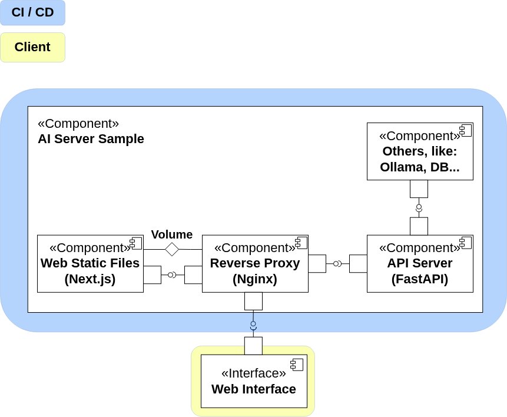
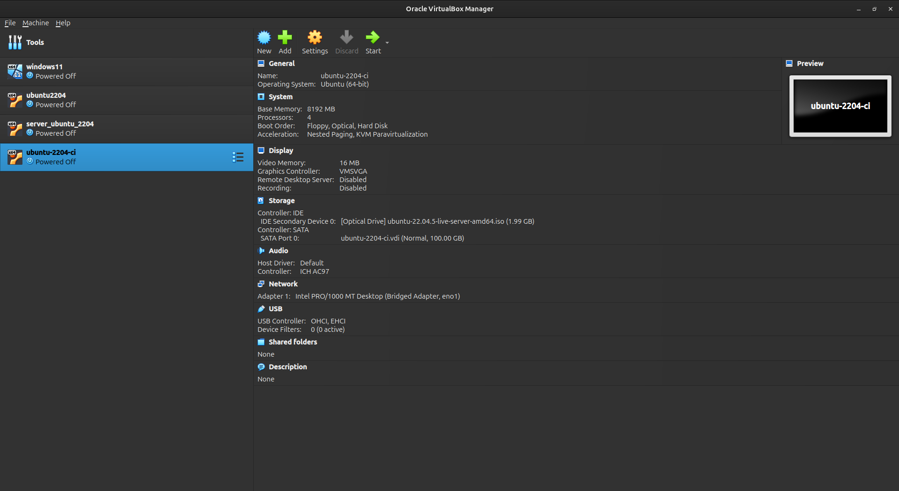
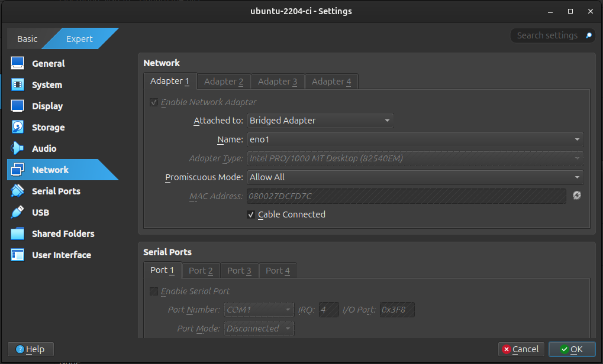
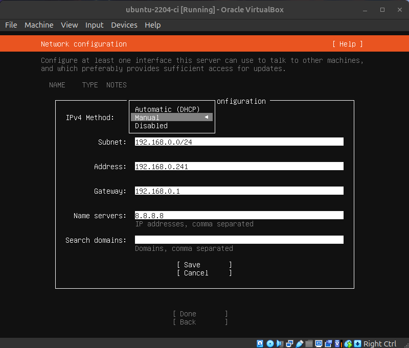
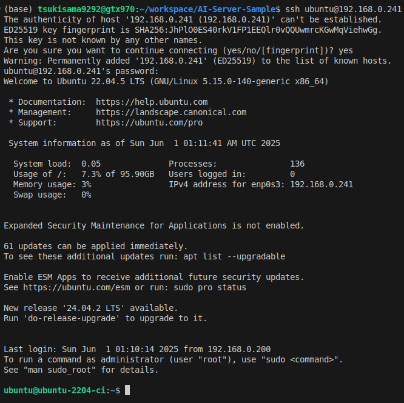
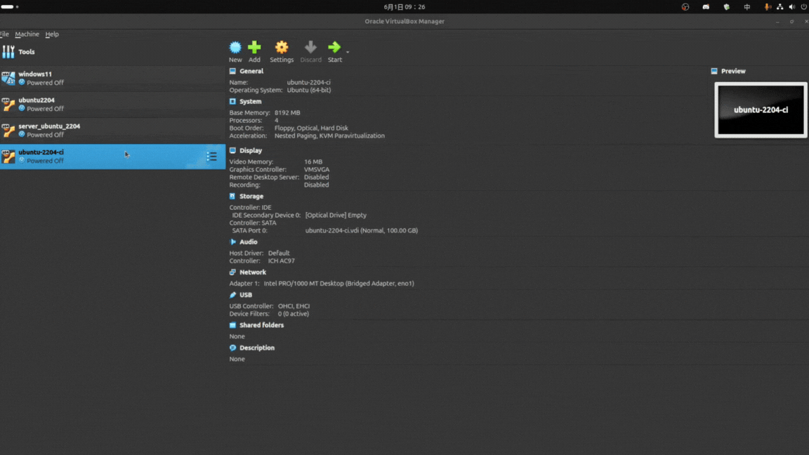
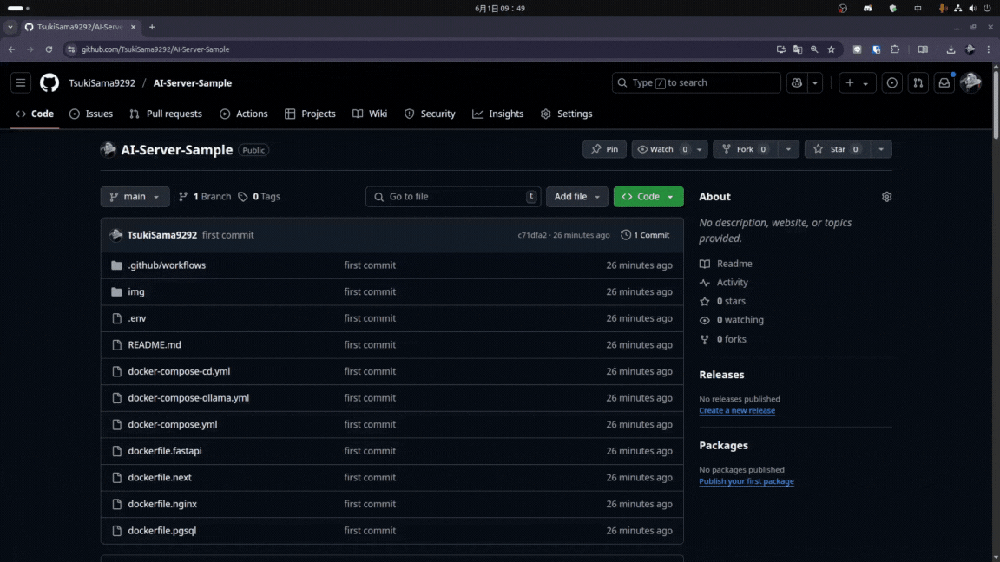
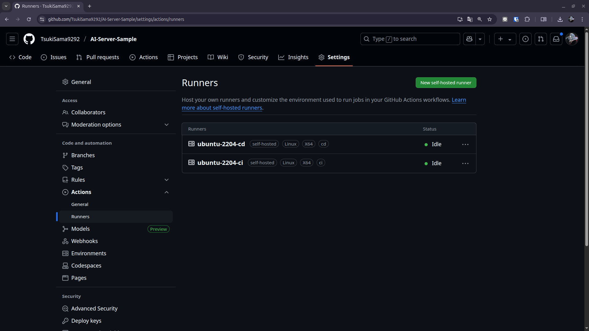

# AI Server 範本

## 🚀 [AI 網頁伺服器範本 - 最新程式碼 dev 分支](https://github.com/TsukiSama9292/AI-Server-Sample/tree/dev)

## 🧩 用途  
📚 教學用  
🙏 供有興趣者參考，不用發 PR，請自由取用  

## ✨ 特色  
📐 伺服器組件圖（架構圖，使用 UML 2.X）  
📘 詳細的操作引導  
📁 具備檔案結構介紹  

## 📜 開源協議  
✅ MIT - 寬鬆協議

## 🛠️ 技術棧  

| 項目          | 工具                          | 說明                                                                 | 介紹 |
|---------------|-------------------------------|----------------------------------------------------------------------| ------------------------------------------------------------------|
| **CI/CD**     | ⚙️ Github Actions             | 分支策略，實現持續集成和部署 🚀                                      | - [CI](./.github/workflows/ci.yml)<br>- [CD](.github/workflows/cd.yml) |
| **Proxy Server** | 🌐 Nginx                   | 作為反向代理伺服器，處理 HTTP 請求並轉發至前後端服務 🔁               | [Nginx](./nginx/README.md) |
| **Back-End**  | 🐍 FastAPI + 🧠 LangChain     | 建立 API 的 Python 框架，LangChain 負責 Agent 邏輯處理              | [FastAPI](./fastapi/README.md) |
| **Front-End** | 💻 Next.js (React)            | 建立前端網頁 🖼️                                                       | [Next.js](./nextjs/README.md) |
| **AI Server** | 🤖 Ollama                     | 支援 CPU，提供 AI 模型服務 🧩                                        | [Ollama](https://hub.docker.com/r/ollama/ollama) |
| **DB**        | 🐘 PostgreSQL + 🧪 PGLite     | 預計使用，資料存儲用途 💾                                             | - [PostgreSQL](https://hub.docker.com/_/postgres)<br>- [PGLite](https://pglite.dev/) |


## 架構圖 - [線上架構圖](https://viewer.diagrams.net/?tags=%7B%7D&lightbox=1&highlight=0000ff&edit=_blank&layers=1&nav=1&title=ai-sample-server.drawio&dark=auto#Uhttps%3A%2F%2Fdrive.google.com%2Fuc%3Fid%3D1QD_Iwv_ZQpG5kS-wWtm0l2T6u9CXrsgk%26export%3Ddownload)


## ⚙️ 前置條件

以下是官方社群版本的 Ubuntu 安裝步驟，已經安裝過可忽略。  

- 🐳 Docker  
- 📦 Docker Compose  

```bash
sudo apt-get update
sudo apt-get install ca-certificates curl
sudo install -m 0755 -d /etc/apt/keyrings
sudo curl -fsSL https://download.docker.com/linux/ubuntu/gpg -o /etc/apt/keyrings/docker.asc
sudo chmod a+r /etc/apt/keyrings/docker.asc
echo \
  "deb [arch=$(dpkg --print-architecture) signed-by=/etc/apt/keyrings/docker.asc] https://download.docker.com/linux/ubuntu \
  $(. /etc/os-release && echo "${UBUNTU_CODENAME:-$VERSION_CODENAME}") stable" | \
  sudo tee /etc/apt/sources.list.d/docker.list > /dev/null
sudo apt-get update
sudo apt-get install docker-ce docker-ce-cli containerd.io docker-buildx-plugin docker-compose-plugin -y
sudo usermod -aG docker $USER
sudo reboot
```

---

## 📁 檔案結構
```bash
AI-Server-Sample/
├── 🐳 docker-compose-ollama.yml   # 📦 CD 環境: Ollama 用的 docker-compose 檔案
├── 🐳 docker-compose-server.yml   # 🌐 伺服器用的 docker-compose 檔案
├── 🐳 docker-compose.yml          # 👨‍💻 開發用的 docker-compose 檔案
├── 🐍 dockerfile.fastapi          # ⚙️ FastAPI 的 Dockerfile
├── 💻 dockerfile.nextjs           # 🖼️ Next.js 的 Dockerfile
├── 🌐 dockerfile.nginx            # 🔁 Nginx 的 Dockerfile
├── 🧾 .env                        # 📌 環境變數檔案 → For Docker Compose
├── 🐍 fastapi                     # 🧠 FastAPI 應用程式的目錄
├── 🔧 .github                     # 🤖 GitHub Actions 的目錄
│   └── 🔁 workflows               # ⚙️ 工作流程的目錄
│       ├── 🚀 cd.yml              # 🚚 CD 的工作流程
│       └── 🧪 ci.yml              # 🧪 CI 的工作流程
├── 🖼️ img                         # 🖼️ 圖片目錄
├── 📄 LICENSE                     # 📜 專案許可證文件
├── 💻 nextjs                      # 🖥️ Next.js 應用程式的目錄
├── 🌐 nginx                       # 🌐 Nginx 的目錄
└── 📘 README.md                   # 📝 專案說明文件
```

## 📘 使用說明

### 🖥️ 建立 CI VM

- 🧠 **CPU**: 4 核心  
- 🧵 **RAM**: 8 GB  
- 💾 **磁碟**: 100 GB  
- 🌐 **網路**: 橋接模式，選擇主機的網路介面卡，IP: `192.168.0.241`  
- 🐧 **作業系統**: Ubuntu 22.04 LTS  
- 👤 **使用者**: ubuntu  
- 🔐 **密碼**: ubuntu  
- 🏷️ **伺服器名稱**: `ubuntu-2204-ci`  

- 🛠️ **安裝步驟**:
  1. 🧱 建立虛擬機  
     
  2. 🌐 網路設定  
     
  3. ⚙️ 啟動虛擬機並進行系統安裝  
     在安裝過程中設定網路，請照自己的路由器設定 IP 位址，  
     否則可建立 `僅限主機` 的網路  
     
  4. 🔌 系統安裝完畢，重啟後使用 SSH 登入  
     
  5. 🐳 [安裝 Docker 社群版](#前置條件)
  6. 📦 [先完成 CD 環境的虛擬機](#建立-cd-環境)

### 🖥️ 建立 CD VM (複製 CI VM)

- 🧠 **CPU**: 4 核心  
- 🧵 **RAM**: 16 GB  
- 💾 **磁碟**: 100 GB  
- 🌐 **網路**: 橋接模式，選擇主機的網路介面卡，IP: `192.168.0.242`  

- 🛠️ **安裝步驟**:
  1. 📋 複製 CI 環境的虛擬機  
     

  2. 🔑 遺忘 SSH 金鑰  
      ```bash
      ssh-keygen -R 192.168.0.241
      ```

  3. 🔐 SSH 登入，修改虛擬機的名稱  
      ```bash
      ssh ubuntu@192.168.0.241
      ```
      ```bash
      sudo hostnamectl set-hostname ubuntu-2204-cd
      ```
      ```bash
      sudo nano /etc/hosts
      ```
      ```bash
      127.0.1.1   ubuntu-2204-cd
      ```

  4. 🌍 修改虛擬機的網路設定，確保 IP 位址不同  
      ```bash
      sudo nano /etc/cloud/cloud.cfg.d/99-disable-network-config.cfg
      ```
      ```bash
      network: {config: disabled}
      ```
      ```bash
      sudo nano /etc/netplan/50-cloud-init.yaml
      ```yaml
      network:
          ethernets:
              enp0s3:
                  addresses:
                  - 192.168.0.242/24
                  nameservers:
                      addresses:
                      - 8.8.8.8
                      search: []
                  routes:
                  -   to: default
                      via: 192.168.0.1
          version: 2
      ```
      ```bash
      sudo netplan apply
      ```

  5. ❌ 關閉 SSH 視窗

  6. 🔐 SSH 登入新 IP  
      ```bash
      ssh ubuntu@192.168.0.242
      ```

### Github Actions Runner 建立
1. SSH 登入
    🔑 SSH 遺忘金鑰 
    ```bash
    ssh-keygen -R 192.168.0.241
    ```
    🖥️ CI VM SSH 登入  
    ```bash
    ssh ubuntu@192.168.0.241
    ```
    🖥️ CD VM SSH 登入  
    ```bash
    ssh ubuntu@192.168.0.242
    ```
2. 🚀 Github 儲存庫建立 Runner
  - 🛠️ 前往 GitHub 儲存庫的設定頁面，點選 "Actions" -> "Runners" -> "New self-hosted runner"，預設 Linux
    
  - 🖥️ 兩個 VM 都跟隨指示下載並安裝 Runner
      📂 建立資料夾，推薦自定名稱
      ```bash
      mkdir ai-sample-actions-runner && cd ai-sample-actions-runner
      ```
      ⬇️ 下載 Runner 壓縮檔，請根據 Github 儲存庫指令，以下為範例指令：
      ```bash
      curl -o actions-runner-linux-x64-2.324.0.tar.gz -L https://github.com/actions/runner/releases/download/v2.324.0/actions-runner-linux-x64-2.324.0.tar.gz
      ```
      📦 解壓縮 Runner 壓縮檔
      ```bash
      tar xzf ./actions-runner-linux-x64-2.324.0.tar.gz
      ```
      ⚙️ 設定 Config，每次的 Token 都不同，一個 Token 只能用一次，請根據 Github 儲存庫指令，以下為範例指令：
      ```bash
      ./config.sh --url https://github.com/TsukiSama9292/AI-Server-Sample --token BADCU6CIOZZ4UAVHPMNBEOTIHPBBO
      
      # 設定
      >> Enter the name of the runner group to add this runner to: [press Enter for Default] -> 直接 Enter，或輸入自定名稱
      >> Enter the name of runner: [press Enter for ubuntu-2204-ci] -> 直接 Enter，或輸入自定名稱
      >> This runner will have the following labels: 'self-hosted', 'Linux', 'X64' 
      >> Enter any additional labels (ex. label-1,label-2): [press Enter to skip] -> 輸入 ci 或 cd
      >> Enter name of work folder: [press Enter for _work] -> 直接 Enter
      ```
      🔄 通常要在每次重啟時執行 Runner，可以用 `crontab` 來設定自動啟動
      ```bash
      crontab -e
      >>  no crontab for ubuntu - using an empty one
          Select an editor.  To change later, run 'select-editor'.
            1. /bin/nano        <---- easiest
            2. /usr/bin/vim.basic
            3. /usr/bin/vim.tiny
            4. /bin/ed
      >> 選擇 1
      ```
      👉 滑到最底下，加入以下指令，確保每次重啟時都會執行 Runner
      ```bash
      @reboot /home/ubuntu/ai-sample-actions-runner/run.sh
      ```
      🔄 完成後，直接重啟 VM
      ```bash
      sudo reboot
      ```
  - ✅ 完成後，回到 GitHub 儲存庫的 Runner 設定頁面，應該會看到新建立的 Runner
    

### 🏭 CD 環境  
有用 GitHub Actions Runner  
可直接使用 GitHub Actions 部署 🚀  
也可以手動部署，以下為步驟：

1. ▶️ 啟用 Ollama 服務
```bash
docker compose -f docker-compose-ollama.yml up -d
```
2. ⚙️ (可選) 預先下載模型
```bash
docker exec ai_server_sample_ollama bash -c "ollama pull gemma3:1b-it-qat"
```

### 🖥️ 開發環境不限，但必須有 Docker 和 Docker Compose 🐳

可以考慮使用 [Kasm Workspace](https://www.kasmweb.com/) 🚀  
本人也有提供 Kasm 的鏡像範本，除了官方的 ubuntu dind 鏡像功能之外  
額外安裝了 dbeaver 🗃️, nvm 🔧, npm 📦, node.js 🟢, Postman 📬, Discord 💬  

- 🏷️ [Workspace 鏡像區](https://tsukisama9292.github.io/kasm_registry/)  
- 🐳 [Docker Hub](https://hub.docker.com/r/tsukisama9292/ubuntu-jammy-dind)  