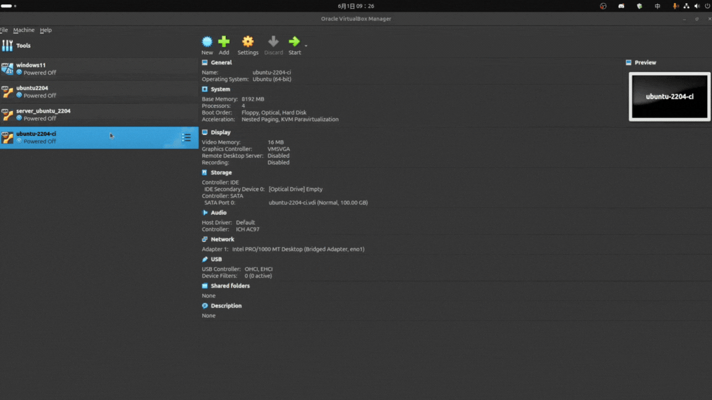

# 💻 虛擬機介紹、安裝、建立指南 🚀

打造屬於自己的「電腦中的電腦」！無論你是 DevOps 新手還是想架設測試環境的工程師，這份指南都能一步步帶你建構出功能齊全的虛擬機 💡

---

## 📌 什麼是虛擬機？🤔

虛擬機（Virtual Machine, VM）就像是一台住在你電腦裡的小電腦 🖥️  
它讓你可以在主機系統上「模擬」另一套作業系統，好處多多，包括：

- 🧪 測試新系統或軟體不怕壞掉主機
- 🧰 模擬伺服器環境
- ⚙️ CI/CD 自動化流程的理想環境

---

## 🧰 安裝工具準備好了嗎？🛠️

我們將使用 **VirtualBox** 來建立 VM，一套免費又強大的開源工具 📦

### 🔗 [VirtualBox 官方下載](https://www.virtualbox.org/)

- ✅ 跨平台支援 Windows、macOS、Linux  
- ✅ 容易上手，社群資源豐富

⚠️ **安裝完主程式後，別忘了也要安裝 Extension Pack！**  
提供 USB 裝置支援、RDP 遠端桌面等功能  
👉 [下載 Extension Pack](https://www.virtualbox.org/wiki/Downloads)

---

## 🏗️ 建立你的第一台虛擬機器！🔥

準備好了嗎？現在開始打造屬於你的 VM 👇

### 🖥️ 建立 CI VM

- 🧠 **CPU**: 4 核心  
- 🧵 **RAM**: 8 GB  
- 💾 **磁碟**: 100 GB  
- 🌐 **網路**: 橋接模式，選擇主機的網路介面卡，IP: `192.168.0.241`  
- 🐧 **作業系統**: Ubuntu 22.04 LTS  
- 👤 **使用者**: ubuntu  
- 🔐 **密碼**: ubuntu  
- 🏷️ **伺服器名稱**: `ubuntu-2204-ci`  

- 🛠️ **安裝步驟**:
  1. 🧱 建立虛擬機  
     
  2. 🌐 網路設定  
     
  3. ⚙️ 啟動虛擬機並進行系統安裝  
     在安裝過程中設定網路，請照自己的路由器設定 IP 位址，  
     否則可建立 `僅限主機` 的網路  
     
  4. 🔌 系統安裝完畢，重啟後使用 SSH 登入  
     
  5. 🐳 [安裝 Docker 社群版](#前置條件)
  6. 📦 [先完成 CD 環境的虛擬機](#建立-cd-環境)

### 🖥️ 建立 CD VM (複製 CI VM)

- 🧠 **CPU**: 4 核心  
- 🧵 **RAM**: 16 GB  
- 💾 **磁碟**: 100 GB  
- 🌐 **網路**: 橋接模式，選擇主機的網路介面卡，IP: `192.168.0.242`  

- 🛠️ **安裝步驟**:
  1. 📋 複製 CI 環境的虛擬機  
     

  2. 🔑 遺忘 SSH 金鑰  
      ```bash
      ssh-keygen -R 192.168.0.241
      ```

  3. 🔐 SSH 登入，修改虛擬機的名稱  
      ```bash
      ssh ubuntu@192.168.0.241
      ```
      ```bash
      sudo hostnamectl set-hostname ubuntu-2204-cd
      ```
      ```bash
      sudo nano /etc/hosts
      ```
      ```bash
      127.0.1.1   ubuntu-2204-cd
      ```

  4. 🌍 修改虛擬機的網路設定，確保 IP 位址不同  
      ```bash
      sudo nano /etc/cloud/cloud.cfg.d/99-disable-network-config.cfg
      ```
      ```bash
      network: {config: disabled}
      ```
      ```bash
      sudo nano /etc/netplan/50-cloud-init.yaml
      ```
      ```yaml
      network:
          ethernets:
              enp0s3:
                  addresses:
                  - 192.168.0.242/24
                  nameservers:
                      addresses:
                      - 8.8.8.8
                      search: []
                  routes:
                  -   to: default
                      via: 192.168.0.1
          version: 2
      ```
      ```bash
      sudo netplan apply
      ```

  5. ❌ 關閉 SSH 視窗

  6. 🔐 SSH 登入新 IP  
      ```bash
      ssh ubuntu@192.168.0.242
      ```
